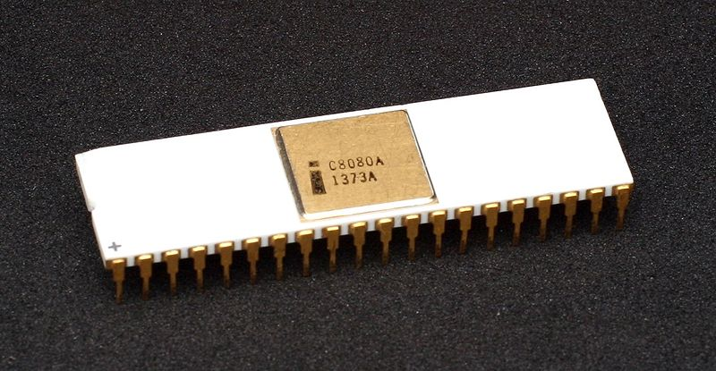

# i8080(Intel 8080) 

The Intel 8080 ("eighty-eighty") is the second 8-bit microprocessor designed and manufactured by Intel. It first appeared in April 1974 and is an extended and enhanced variant of the earlier 8008 design, although without binary compatibility.[2] The initial specified clock rate or frequency limit was 2 MHz, and with common instructions using 4, 5, 7, 10, or 11 cycles this meant that it operated at a typical speed of a few hundred thousand instructions per second. A faster variant 8080A-1 (Sometimes called the 8080B) became available later with clock frequency limit up to 3.125 MHz.

> Made in C++ lang

> [License](LICENSE)

> [Documentation](src/doc.md)

> [About](utils/intel8080.pdf)

## Tests Performed

Source for tests in file [i8080_tests.cpp](src/intel8080/i8080_tests/i8080_tests.cpp),the intel8080 code is still undergoing tests due to some occurrences in the instructions. run tests execute `make` 

> - [x] 8080TST.COM
> - [x] 8080PRE.COM

## Disassembly
the disassembly of the instructions must be activated by the DISASSEMBLY macro, it will generate a disassembly of the instructions being executed in real time.

## References

 
 * http://www.emulator101.com/reference/8080-by-opcode.html

 * https://altairclone.com/downloads/manuals/8080%20Programmers%20Manual.pdf

 * https://pastraiser.com/cpu/i8080/i8080_opcodes.html

 * https://en.wikipedia.org/wiki/FLAGS_register

 * http://www.emulator101.com/full-8080-emulation.html

 * https://github.com/begoon/i8080-core

 * https://en.wikipedia.org/wiki/Intel_8080
